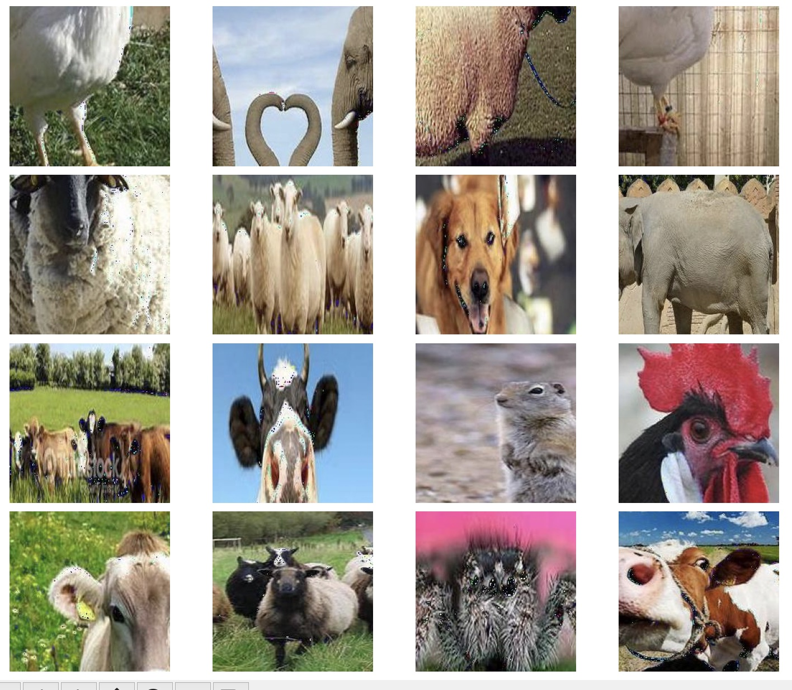
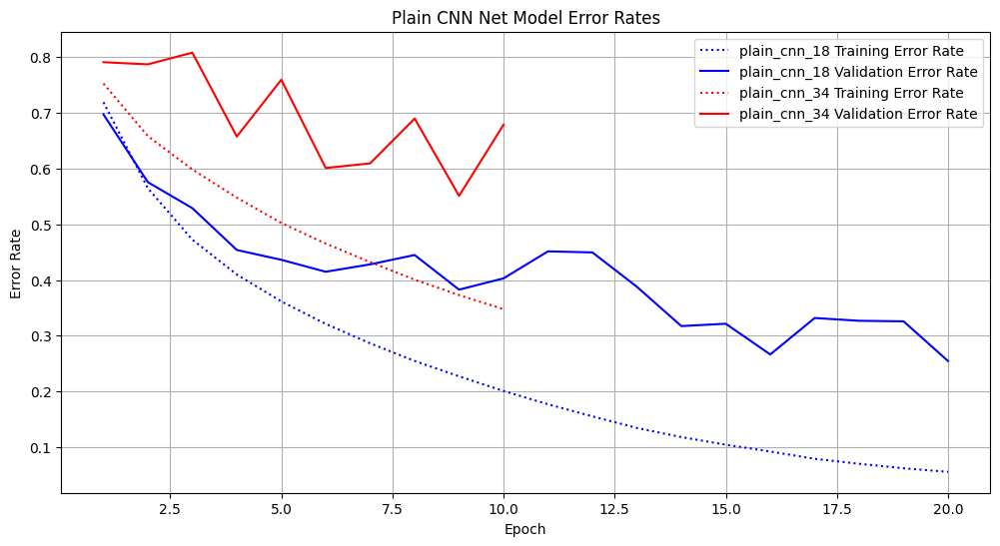
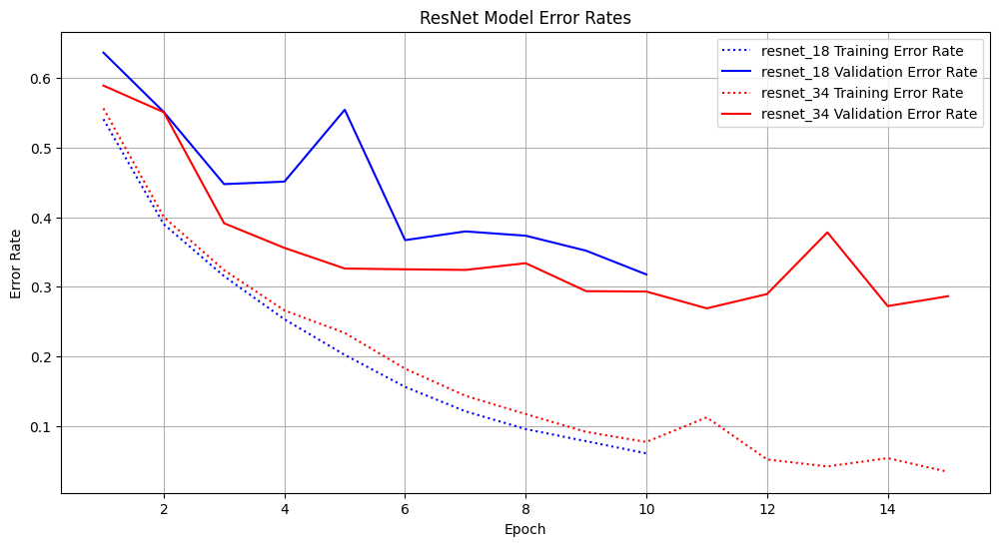
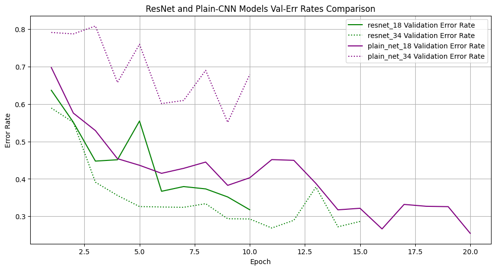
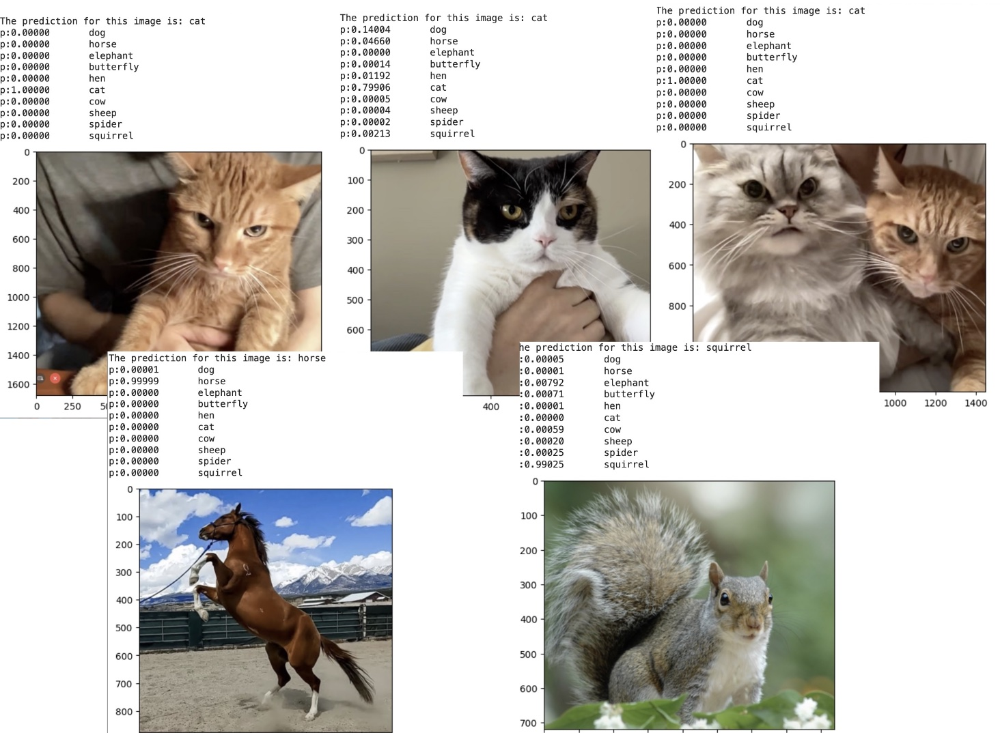

## Summary

### Repo Introduction

This repo implements and performs an experiment between **ResNet** model and **Plain CNN model** which are described in the paper of  *Deep Residual Learning for Image Recognition*.

The implementation is straight-forward and beginner-friendly. Python files are organized into the standard sequential steps of learning:
 i. data augmentation
 ii. model definition of ResNet and Plain CNN using `Keras`
 iii. training scripts
 iv. automatic model analysis
 v. prediction examples
 
 ### Quick Peeks

(0) Sampling from training dataset.

  

(1) For Plain CNN, 34 layer is worse than its 18 layer version. While for ResNet, 34 layer is better. And comparably speaking, ResNet is way better than Plain CNN models for both 18 layer model and 34 layer model.

  
  

  

(2) Some predictions for unseen data.

  

