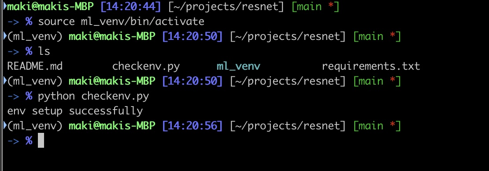
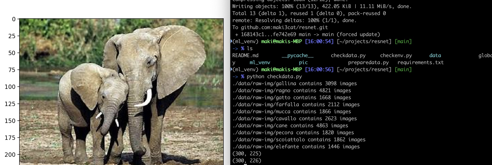
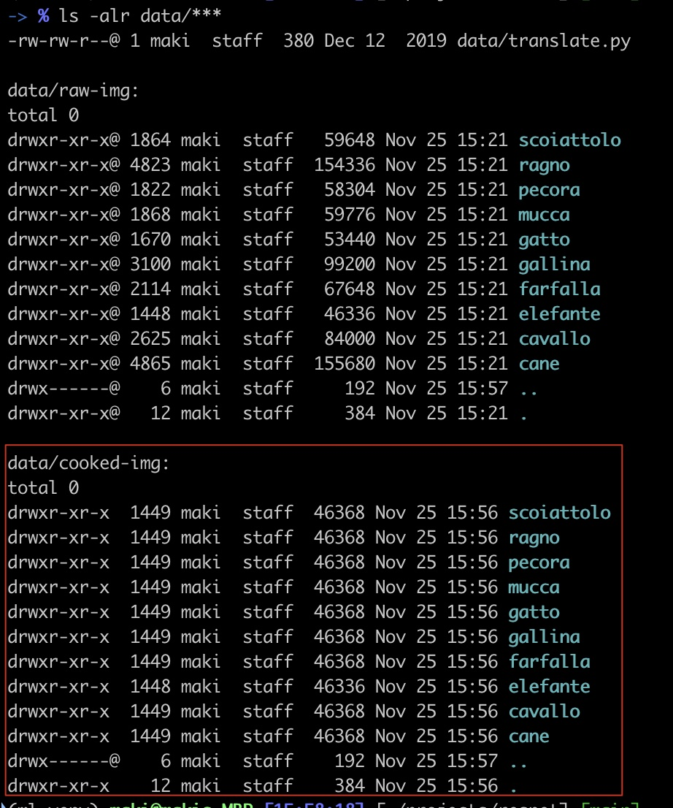

## Report Link

[docs of the project](https://docs.google.com/document/d/1nRsXoV5Iscx5vBJ4m6PW8BhzffM8paUp0kCJNxe5bLs/edit?tab=t.0)

## Env Setup

### 1) activate virtual env
- Option-1) setup the resnet coding env from scrath
    - `python3.11 -m venv ml_venv`
    - (there is no need to change system python version, but the project requires python3.11)

- Option-2) enter the resnet coding env again
    - `source ml_venv/bin/activate`

### 2) install python libs
- install/update dependent libs, use `pip install -r requirements.txt`
- after `pip install somenew package`, use `pip freeze > requirements.txt` to upgrade

### 3) check if everything is correct
run `python checkenv.py` and should have the following output:

## Data Preparation
1. download data
    - download the [dataset](https://www.kaggle.com/datasets/alessiocorrado99/animals10)
    - put it in data directory of the project (data is not included in the git)
2. check data
    - run `python checkdata.py` to peek into the data
    - an elephant and some picture shapes will be printed
    - 
3. preprocess data to avoid overfitting, etc
    - run `python preparedata.py`
    - the preprocessed data will be in the data image 
    - 

## Model Definition and Training Process
(please use interactive python to train the model, so that the result can be used to do prediction
4. resnet model
    - resnetmdl.py

5. training process
    - train.py
